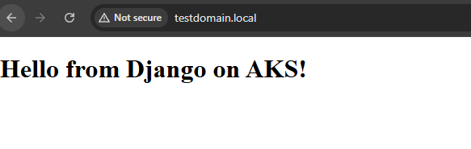

# AKS, ACR, OIDC, and Ingress Troubleshooting Reference

## Prerequisites Before Running Terraform

Before you run Terraform, ensure the following manual steps are completed:

1. **Azure AD App Registration & Service Principal Permissions**
   - Assign the Cloud Application Administrator role to the GitHub OIDC app registration (github-oidc-aks) at the tenant level.
   - Assign the Contributor role to the service principal at the subscription level.
   - These permissions cannot be granted by Terraform itself; they must be set by a user with sufficient Azure privileges.

2. **Terraform Permissions**
   - The identity running Terraform must have Owner or User Access Administrator permissions at the subscription level to create role assignments and manage resources.

3. **Azure CLI Authentication**
   - Ensure you are logged in to Azure CLI with an account that has the required permissions.

4. **Resource Group and Subscription**
   - Confirm the target resource group and subscription exist and are specified in your Terraform variables.

---

Terraform will automate:
- App registration and service principal creation
- Federated credential setup for GitHub Actions
- Role assignments for ACR and AKS kubelet identities
- (Optionally) Contributor role assignment if you have sufficient privileges

Manual steps are required for tenant-level and subscription-level permissions before running Terraform for the first time.

## 1. Initial Setup (Terraform)
- Provision AKS, ACR, and supporting Azure resources using Terraform.
- Configure OIDC federated credentials for GitHub Actions.
- Assign roles for AKS managed identity and ACR access.

## 2. Detailed Permission Troubleshooting

### A. AKS Image Pull 401 Error
- **Symptom:** AKS pods fail to pull images from ACR (401 Unauthorized).
- **Root Cause:** The AcrPull role was assigned to the AKS managed identity, but the actual image pull is performed by the node pool (kubelet) managed identity.
  - **Note:** The kubelet managed identity is assigned per node pool. All nodes in a single node pool share the same object ID. If you have multiple node pools, each may have a different kubelet identity object ID. You must assign AcrPull to each node pool's kubelet identity if you use multiple pools.
- **How to Identify:**
  - Use Azure CLI to inspect the AKS cluster and find the kubelet identity:
    ```sh
    az aks show -g <resource-group> -n <aks-cluster> --query "identityProfile.kubeletidentity.objectId"
    ```
  - Check role assignments for ACR:
    ```sh
    az role assignment list --assignee <kubelet-object-id> --scope <acr-resource-id>
    ```
- **Resolution:**
  - Assign AcrPull to the kubelet identity:
    ```sh
    az role assignment create --assignee <kubelet-object-id> --role AcrPull --scope <acr-resource-id>
    ```
- **Why Terraform Struggles:**
  - The kubelet identity is dynamically created and not always exposed directly in Terraform outputs. Manual lookup may be required unless you use data sources and outputs to automate this.

### B. OIDC Federated Credentials for GitHub Actions
- **Symptom:** GitHub Actions cannot authenticate to Azure using OIDC.
- **Root Cause:** Federated credentials must be set up for the correct Azure AD app and GitHub repo/environment.
- **How to Identify:**
  - Check federated credentials in Azure AD and match with GitHub repo and environment.
- **Resolution:**
  - Use Terraform to create federated credentials for the Azure AD app used by GitHub Actions.
- **Why Terraform Struggles:**
  - Mapping GitHub environments and secrets to Azure AD can be complex and may require manual validation.

### C. Ingress and DNS Issues
- **Symptom:** 404 Not Found or browser redirects to HTTPS (HSTS).
- **Root Cause:** Host mismatch, ingress class issues, or browser HSTS enforcement.
- **Resolution:**
  - Ensure ingress uses the correct host and ingressClassName.
  - Update hosts file for local testing.
  - Use a new domain to bypass HSTS if needed.
- **Why Terraform Struggles:**
  - DNS and browser behavior are environment-specific and not fully automatable.

### Automated AcrPull Role Assignment for Kubelet Identity (Multiple Node Pools)

If you have multiple node pools, you can automate AcrPull assignment for each kubelet identity using Terraform:

```hcl
# Fetch AKS cluster details
data "azurerm_kubernetes_cluster" "aks" {
  name                = var.aks_name
  resource_group_name = var.resource_group
}

# Assign AcrPull to all kubelet identities (for all node pools)
resource "azurerm_role_assignment" "acr_pull" {
  for_each             = { for k, v in data.azurerm_kubernetes_cluster.aks.kubelet_identity : k => v }
  principal_id         = each.value.object_id
  role_definition_name = "AcrPull"
  scope                = azurerm_container_registry.acr.id
}
```

This ensures every node pool's kubelet identity gets AcrPull on your ACR automatically.

## 3. Recommendations for Better Automation
- Use Terraform outputs to expose kubelet identity and ACR resource IDs.
- Use Terraform data sources to fetch kubelet identity and automate AcrPull assignment:
  ```hcl
  data "azurerm_kubernetes_cluster" "aks" {
    name                = var.aks_name
    resource_group_name = var.resource_group
  }

  resource "azurerm_role_assignment" "acr_pull" {
    principal_id         = data.azurerm_kubernetes_cluster.aks.kubelet_identity[0].object_id
    role_definition_name = "AcrPull"
    scope                = azurerm_container_registry.acr.id
  }
  ```
- Automate DNS record creation for ingress external IP using Terraform and Azure DNS.
- Add post-deployment validation scripts (e.g., GitHub Actions) to check app and ingress health.
- Document troubleshooting steps and known issues for future reference.

## 4. Lessons Learned
- Always verify which identity is used for resource access (AKS node pool vs. managed identity).
- Use Terraform data sources and outputs to automate dynamic resource assignments.
- Document manual steps and automate them where possible for future deployments.

## Automating NGINX Ingress Controller Installation

To automate the installation of the NGINX ingress controller as part of your deployment workflow, you can:

### Option 1: GitHub Actions Workflow Step
Add a step to your CI/CD workflow to install the ingress controller using kubectl:

```yaml
- name: Install NGINX Ingress Controller
  run: |
    kubectl apply -f https://raw.githubusercontent.com/kubernetes/ingress-nginx/controller-v1.10.1/deploy/static/provider/cloud/deploy.yaml
```

### Option 2: Terraform Kubernetes Provider
Use Terraform's Kubernetes provider to apply the ingress controller manifest:

```hcl
provider "kubernetes" {
  host                   = azurerm_kubernetes_cluster.aks.kube_config[0].host
  client_certificate     = base64decode(azurerm_kubernetes_cluster.aks.kube_config[0].client_certificate)
  client_key             = base64decode(azurerm_kubernetes_cluster.aks.kube_config[0].client_key)
  cluster_ca_certificate = base64decode(azurerm_kubernetes_cluster.aks.kube_config[0].cluster_ca_certificate)
}

resource "kubernetes_manifest" "nginx_ingress" {
  manifest = yamldecode(file("${path.module}/k8s/ingress-nginx.yaml"))
}
```

> **Note:** The manifest file (k8s/ingress-nginx.yaml) should contain the official NGINX ingress controller deployment YAML.

---

Automating this step ensures the ingress controller is always present before deploying ingress resources, reducing manual intervention and deployment errors.